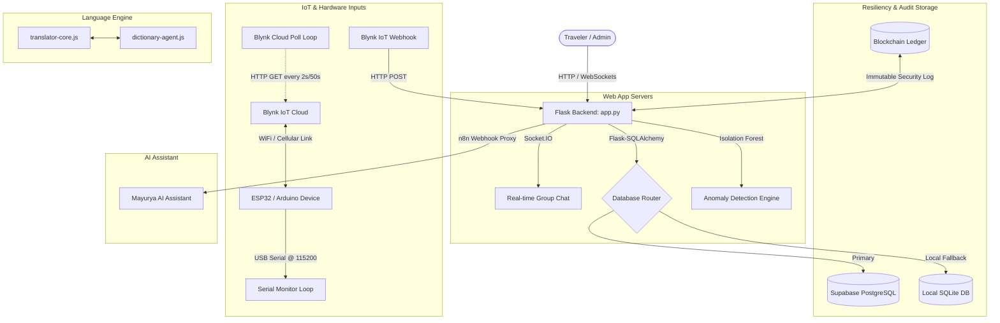

# SAFAR — Project Architecture & Context Guide

> **TravelTogether × Garuda Safety**  
> A unified platform for real-time travel squad coordination, automated tourist safety tracking, and blockchain-audited identity management. Styled in **Divine Futurism**.

---

## 1. Architectural Overview

SAFAR is a Python Flask application that integrates two major user-facing systems backed by automation scripts, database agents, and hardware communication loops.

---

## 2. Core Sub-Systems

### 🧭 TravelTogether (Group Coordination)
* **Purpose**: Allows tourists to discover popular destinations, create public or private travel squads (groups), invite members, and build itineraries together.
* **Real-time Collaboration**: Backed by a full Socket.IO setup that handles user join, leave, typing, and instant messaging events.
* **Document and Media Sharing**: Integrated endpoint (`/api/tt/groups/<group_id>/messages`) supports document uploads (PDF, DOCX, ZIP, etc.), which are securely serialized, saved to subfolders, and made reachable to group members.

### 🛡️ Garuda Safety (Tourist Monitoring)
* **Purpose**: Coordinates safety registration (KYC verified via Aadhaar or Passport) and real-time tourist monitoring.
* **Safety Score Indexing**: Tourists are assigned a dynamic *Safety Score* (0–100%). Scoring tracks factors like proximity to safe regional zones, active movement, and hardware panic states. Entering high-risk zones or triggering panic locks this safety score at 0.
* **Anomaly Detection**: Run via a background check thread (`anomaly_loop` / `check_for_anomalies`) and an admin endpoint. An internal script monitors movement inactivity and security flags using an Isolation Forest pattern, generating administrative visual alerts immediately when anomalous patterns are discovered.

---

## 3. Database Resiliency & Security

### Hybrid Connection Layer (`database.py`)
SAFAR implements a self-resigned postgres connection layer that acts as a secure connector to Supabase:
1. **Primary Database**: PostgreSQL hosted on Supabase, connected through `pg8000` (Pure-Python PostgreSQL adapter) to bypass system libraries.
2. **Local Fallback**: If the remote Supabase database cannot be reached, the system will fall back to local SQLite databases if `ALLOW_SQLITE_FALLBACK=1` is configured in the environment.

### DB Connection Healer: Agent "Rakesh"
A dedicated thread (`rakesh_db_agent`) runs in the background every 30 seconds to inspect the integrity of the database connection:
* **REST API Health Checks**: Performs diagnostics directly against the Supabase REST endpoint to verify cloud infrastructure availability.
* **sqlalchemy Connection Recovery**: If connection timeouts or circuit breaker blocks occur (due to thread/pool stalls), it automatically clears the connection pool using `db.engine.dispose()`, rebuilding connectivity with zero server downtime.

### Security Ledger (Blockchain Blocks)
For critical user transactions (registrations and logins), SAFAR mines blocks inside an immutable transaction ledger using the `BlockchainBlock` database model. Each user register or login event computes a microsecond-stable cryptographic hash linked to all previous transaction blocks. This layout ensures auditable logs that prevent authentication tampering.

---

## 4. Real-time IoT & Hardware Tracking

SAFAR hooks physical sensor rigs (wearable tourists pins or hardware boxes containing GPS and SOS panic toggles) directly into the routing engine:

1. **Direct USB Serial Monitor (`serial_monitor_loop`)**:
   * Reads coordinates and distress flags over physical COM ports from connected devices bypassing cloud network lag. Runs asynchronously inside `app.py`.
2. **Blynk Cloud Polling (`blynk_loop`)**:
   * For remote tourists, a poller runs query requests:
     * **Distress Reflex**: Checks Blynk virtual pin `V3` every **0.4 seconds** (accelerated interval to catch momentary button presses).
     * **Position Checks**: Updates GPS latitude (`V1`) and longitude (`V2`) every **50 seconds** to conserve wearable device battery life.
3. **Blynk Webhooks (`/api/iot/blynk-webhook`)**:
   * Accepts instant HTTP push signals from the Blynk cloud backend to expedite SOS notifications instantly.

### SOS Orchestration
Upon distress trigger (`trigger_hardware_sos`):
* The tourist's `safety_score` locks to $0$.
* An active `Alert` is added to the database.
* An active `Anomaly` is produced at the admin tracking dashboard.
* Emergency group chat messages containing an embedded **Google Maps location link** (`V4` stream) are automatically generated and broadcast to the user's travel squad chat rooms over WebSockets.

---

## 5. Multi-language i18n & Gita Rotation

A custom Javascript-based dictionary system operates in the frontend code to translate the UI dynamically:

* **Dynamic Text replacement**: The combination of `translator-core.js` and `dictionary-agent.js` reads `data-i18n` attributes on layout tags and swaps text content when users toggle language.
* **Three languages supported**: **English**, **Hindi (हिंदी)**, and **Sanskrit (संस्कृतम्)**.
* **Bhagavad Gita quote scroller**: Rotating widget (`GITA_QUOTES`) selects regional quotes from Sanskrit texts, translates them dynamically alongside English/Hindi representations, and loops quotes in a dedicated status bar. Clicking quotes launches a full-screen detailed shloka display modal.

---

## 6. Visual Theme: "Divine Futurism"

The interface blends holy Indian patterns with cyberpunk neon styles:

* **Colors**: Pure grayscale, bright neon cyan/magenta gradients, absolute glassmorphism layouts (`backdrop-filter: blur()`).
* **Visuals**: Clean card styles, border-glow inputs, interactive map pins, and minimal clean typography (e.g., Outfit/Inter font families).
* **Hover Effects & Micropicking**: 3D rotation animations apply to buttons and navigation panels to give interactive responsiveness to layouts.
* **Responsive Styling**: Optimized for both handheld devices (mobile explorers) and widescreen operations (Admin dashboards).

---

## 7. API Routing Index

* **/api/auth/**: Handlers for user registrations, login ledgers, profile definitions.
* **/api/auth/email/**: Emailed one-time-code verification via Supabase Auth, with a CLI console fallback when Supabase is unconfigured.
* **/api/tt/**: Control for destination lists, squad creations, join authorizations, message history.
* **/api/safety/**: Handles location streams, safety alerts, safety zones boundary checks, manual panic triggers.
* **/api/admin/**: Real-time list feeds of alerts, anomalies, status tables for administrative tracking.
* **/cron/**: Cron endpoint to trigger automated Isolation Forest anomaly detection checks.
